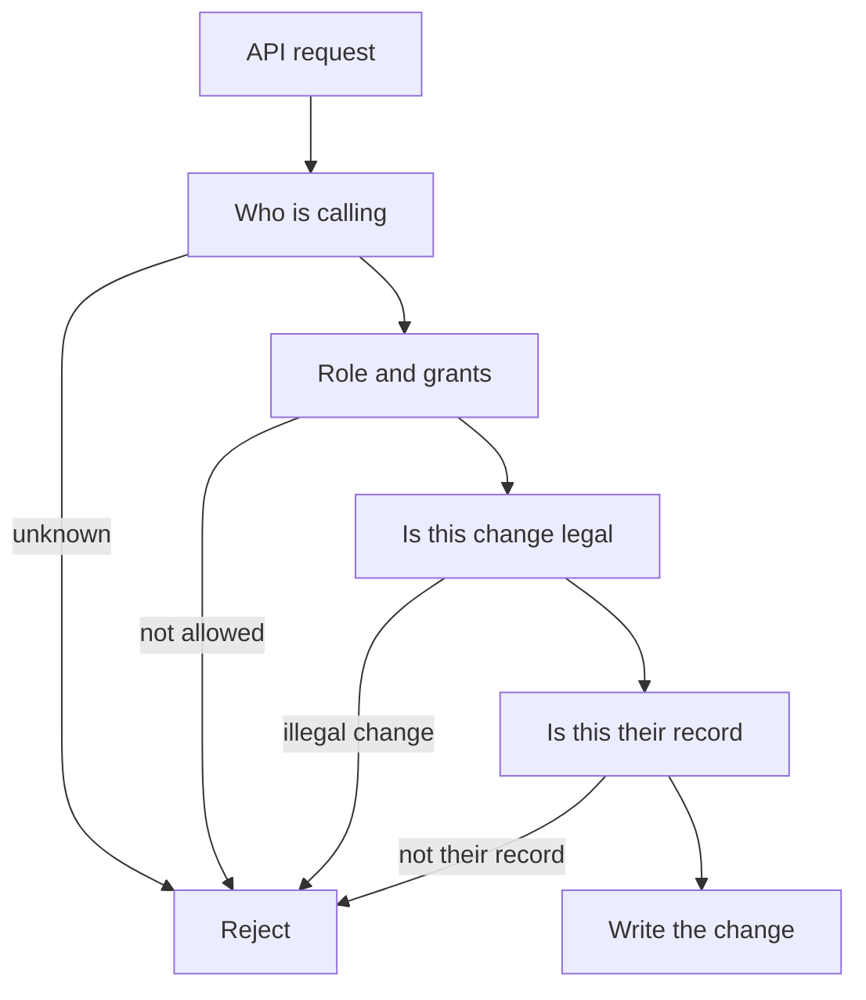

# Authentication

Authentication is who the caller is. Authorization is what they may do. Both are required on the first feature that reads or writes real data. The account work that is in the app is summarized in [../development/accounts.md](../development/accounts.md).

The mobile app signs in with a short-lived bearer access token and a longer-lived refresh token. Passwords are stored as an Argon2id hash. The access token is a JWT. The refresh token is an opaque random value stored only as a hash. Logout revokes that refresh token. Presenting a revoked refresh token revokes the caller's other refresh tokens. Access tokens expire after 15 minutes and are not stored on the server, so a logout finishes blocking new access tokens when the current one expires.

Sign-in and create account take an email or a Sierra Leone phone number, plus a password. Create account only makes a device owner. Email signup sends a 6-digit code, and the account is saved after they enter it. Phone signup checks the number the same way, before the name and password. Brevo sends the email or the text, then a short welcome on the same channel. The app sends them to sign in. It does not log them in. A password reset for an address we don't know still answers the same way and sends nothing. The code is never written to the log.

Continue with Google is different. The phone gets an ID token from Google. The API checks it against Google's certificates and the web client id in `GOOGLE_CLIENT_ID`. The email and name come from that token, not from the form. The Google email has to be verified. The same button signs you in when the email already has an account, and creates a device owner when it does not. A new account gets the welcome email and a session. On the create-account screen the terms box still has to be ticked first. An account that only came from Google has no password. Password sign-in for that account fails the same way as a wrong password. If the email is already tied to a different Google account, the API refuses.

Passwords for this client are 8 to 128 characters. Lockout after bad sign-in attempts is still [TBD]. A verification code allows 5 attempts and expires after 10 minutes.

Roles named for access control: Device owner, Circularity Agent, Technician, Refurbisher, Recycler, Organization, Partner, Administrator.

The permission matrix is blocked by C-03 in [../product/requirements.md](../product/requirements.md). Do not invent the missing grants to fill the grid. Collection point access is [TBD]. Self-registration from the mobile app creates only a device owner.

An agent confirms a collection assigned to that agent. The definition does not say an agent can browse every collection. A device owner sees their own devices and the lifecycle fields that are appropriate. "Appropriate" is [TBD].

A partner sees the device fields required for their service, not the full owner profile by default.

Store passwords only as a strong one-way hash. Do not return the hash. Do not put tokens, passwords, API keys, or verification codes in source, logs, or screenshots. Secret storage for a deployed environment is [TBD] and has to exist before production.

Account recovery for the mobile screens is a 6-digit code and a new password, as above. Lockout after bad sign-in attempts is [TBD]. Rate limiting beyond the verification attempt cap is in [security.md](security.md).

An agent who is offline still acts on tasks already on the phone. Cached identity can allow local capture. It does not make the local record official. The server checks the grant again when the queue arrives. If access was removed before sync, the server rejects the official write. What the phone shows then is [TBD].

Admins use the same sign-in with a stronger grant. A hidden admin password is not a design. Whether admins need a second factor is [TBD].
