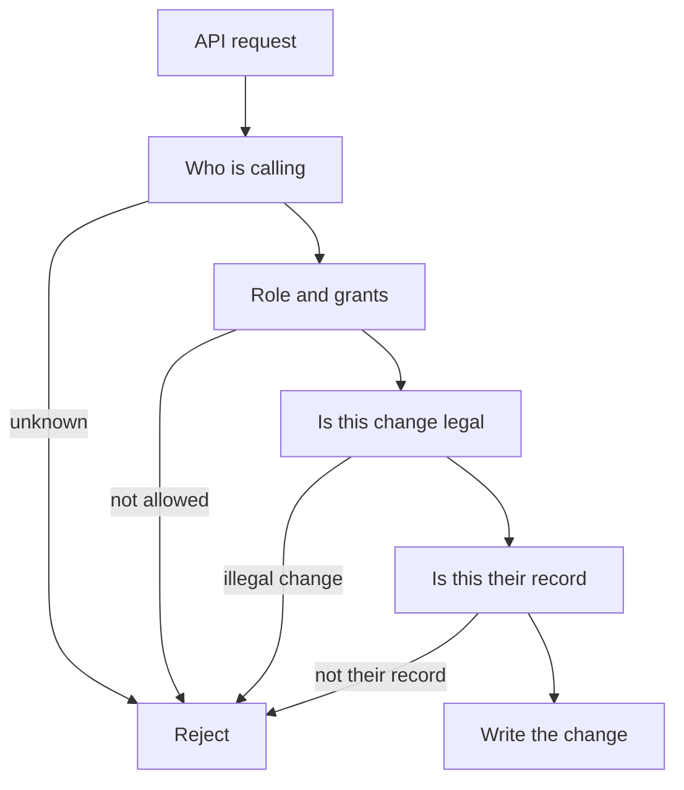

# Authentication

Authentication is who the caller is. Authorization is what they may do. Both are required on the first feature that reads or writes real data. Neither is built.

We need a real sign-in, hashed passwords, protected sessions or tokens, role checks, a higher grant for admin, a server check on every API call, and a limit to the records that role needs.

A token is a short-lived proof sent with each request. A session is identity held on the server. The definition allows either. The choice is [TBD].

The mobile sign-in and create-account screens collect either an email address or a Sierra Leone phone number, with a password. That is input capture only. On create account, phone signup asks for the number, then six code boxes, before the name and password. The resend countdown is display only. No code is sent or checked until an SMS provider is chosen. The server still checks identity. Forgot password collects a registered email address or Sierra Leone phone number, then a 6-digit code, then a new password. A local success screen follows. No code is sent or checked, and the new password is not saved. Account recovery is still [TBD].

Roles named for access control: Device owner, Circularity Agent, Technician, Refurbisher, Recycler, Organization, Partner, Administrator.

The permission matrix is blocked by C-03 in [../product/requirements.md](../product/requirements.md). Do not invent the missing grants to fill the grid. Collection point access is [TBD].

An agent confirms a collection assigned to that agent. The definition does not say an agent can browse every collection. A device owner sees their own devices and the lifecycle fields that are appropriate. "Appropriate" is [TBD].

A partner sees the device fields required for their service, not the full owner profile by default.

Store passwords only as a strong one-way hash. Do not return the hash. Do not put tokens, passwords, or API keys in source, logs, or screenshots. Secret storage for the backend is [TBD] and has to exist before production.

Account recovery, lockout after bad attempts, and password rules are [TBD]. Rate limiting is in [security.md](security.md).

An agent who is offline still acts on tasks already on the phone. Cached identity can allow local capture. It does not make the local record official. The server checks the grant again when the queue arrives. If access was removed before sync, the server rejects the official write. What the phone shows then is [TBD].

Admins use the same sign-in with a stronger grant. A hidden admin password is not a design. Whether admins need a second factor is [TBD].
