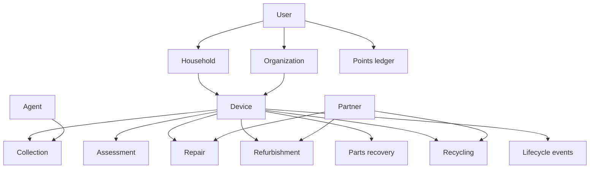

# Database

Use a relational database for the transactional core. The product is [TBD]. No tables exist. This note is the conceptual model from the definition, not a schema.

A production diagram with real cardinalities is still design work. How many households a user belongs to, and how many users a household has, is not specified, so it is not drawn as a number.

The store has to represent users, roles, permissions, households, organizations, devices, device identifiers, collections, agents, assessments, repairs, refurbishment, parts recovery, recycling, partners, collection points, points transactions, notifications, audit events, sync events, and impact measures.

Impact numbers should come from the operational records. Do not keep a second set of totals that can drift. A stored summary is fine later if it can be rebuilt. That design is [TBD].

The definition's sketch links a user to a household and devices, and a partner to pathway work. It does not draw organizations or collection points. Both are required elsewhere, so they stay in this picture. How a user belongs to a household or an organization is [TBD].

Ownership transfer is open. The device stores an ownership reference. Do not assume collection changes who owns it.

## Device fields

| Field | Purpose |
| --- | --- |
| Device ID | Internal id. Primary identifier |
| Device type | Phone or other category |
| Brand | Manufacturer |
| Model | Model |
| Serial number | External id, when the device has one |
| IMEI | Mobile identifier, when it applies. Sensitive |
| Condition | Physical and functional condition |
| Ownership | Current ownership reference |
| Collection status | Collection state |
| Lifecycle status | Circular pathway state |
| Assessment | Diagnostic detail |
| Repair status | Repair progress |
| Refurbishment status | Refurbishment progress |
| Recycling status | Recycling progress |
| Created at | Registration time |
| Updated at | Last change |

The internal Device ID stays primary even when a serial number or IMEI is present. External ids can be missing.

Collection status and lifecycle status are both required, and the words overlap. See C-01 and C-02 in [../product/requirements.md](../product/requirements.md). Do not store both as if a mapping already exists.

## History

A meaningful lifecycle change is stored as history. Handover, partner, and audit records belong there. Keep timestamps. The definition says "relevant timestamps" and does not list them. Make that list during schema design. Do not delete earlier events when a new status is saved.

Sync events store the transaction id used to reject duplicates.

The points ledger grows by new rows: earn, adjustment, redemption, expiry, reversal. Once rules exist, the balance should be computable from those rows. The rules are [TBD], so there is no formula.

IMEI needs tighter handling than a normal column. Encrypting the stored value is one option. Which fields, and how, is [TBD]. IMEI is in scope. Do not copy an owner's personal details onto every related row if a reference is enough.

How long records, photos, and logs are kept is [TBD]. A status change is not a delete.
