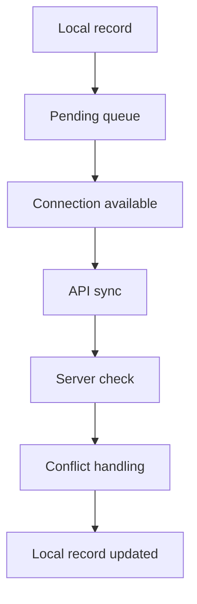

# Offline sync

Agents have to keep working when mobile data is missing or unreliable. That is a product requirement, not an enhancement.

The offline list in the definition is for field work. Device owners are expected to cope with a slow connection. A full offline device owner app is not what was specified.

Once tasks are on the phone, an agent with no connection can view them, create collection records, register devices, capture an assessment, capture required photos, record handovers, update the local lifecycle, and queue events.

New assignments do not appear until there is a connection.

Every queued transaction has its own id. The server uses that id to reject a duplicate. Lifecycle events that matter are kept. A failed or repeated sync does not erase them. The server decides whether the event is accepted. The local lifecycle is a working copy until then.

Photos travel with the transaction that needs them, or as a linked upload that uses the same transaction id. The upload mechanism is [TBD].

A conflict is a queued change that does not fit the official record. Examples: the collection was cancelled while the agent was offline, someone else already moved the device, the same device id was registered twice.

The product requires conflict handling and forbids a second official event. It does not say which side wins. That policy is [TBD]. Decide it with C-01 and C-02.

Until then, the safe design is: do not apply an illegal transition, keep the local event so someone can look at it, and show the agent that the server refused it. That screen is not designed.

The queue has to still be there after the app restarts. Memory is not enough. The storage library is [TBD].

Sync the pending changes, not a full copy of the database, unless recovery needs the full copy. Large photos should be able to retry. The retry rule is [TBD].
