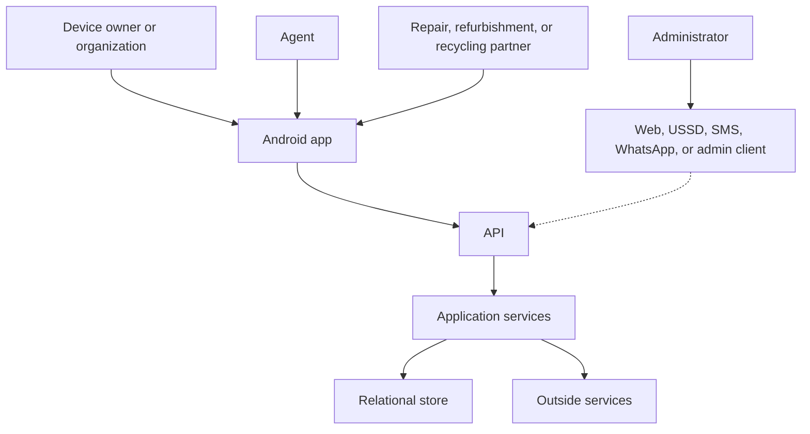

# Architecture

The phone talks to an API. The API is the only door to official data. Shared rules live on the server. The Circularity Registry is the history of each device.

The dotted line is not selected yet.

For the pilot, one Android app covers device owner and agent. Whether partners use that same app is [TBD]. Admin is a separate client. Its stack is [TBD]. Public web, USSD, SMS, and WhatsApp are not selected as ways to use the product. SMS, WhatsApp, and email may later carry notifications.

Inside the backend these are modules in one service, not a requirement to deploy them apart:

Collections, devices, lifecycle, registry, assessment, repair and refurbishment, parts recovery and recycling, then the store, then reporting. Reporting reads the operational data. It does not write a second lifecycle status.

Splitting those modules into separately deployed services is out of the first release unless a later review shows a concrete need.

## How we choose

Use the smallest design that meets the rule. An accurate device history matters more than a fashionable tool. Agents have to finish supported work with no connection. Core actions go through the API. Access control and privacy are part of the first design. Reports come from validated records. A module can be replaced without a rewrite. Assume uneven connectivity, small screens, and the cost of operating in Sierra Leone. The backend owns the rules. Clients do not each invent their own.

## Chosen

| Decision | Choice |
| --- | --- |
| Mobile | Flutter, Android |
| API | Versioned HTTP. Conceptual prefix `/api/v1/`. Contracts are not written |
| Store | Relational. Product [TBD] |
| Backend runtime | [TBD]. No scaffold until it is chosen |
| Admin client | Capability is in scope. Technology [TBD] |
| Map, SMS, WhatsApp, email, payments | [TBD]. See [integrations.md](integrations.md) |

## What the phone is allowed to decide

The phone can be offline, lost, or untrusted. It does not decide whether a lifecycle change is official. The server checks identity, role, and the transition before the registry changes. An offline record is provisional until the server accepts it. A map or messaging vendor gets only what that call needs.

## When something fails

Error codes are [TBD]. The behavior we do know:

- A rejected action comes back as a failure. The registry does not change.
- If the network drops during field work, the local record stays in the sync queue.
- Sending the same sync twice does not create a second lifecycle event.
- A clash between the phone and the server is handled in the open. Do not overwrite an important lifecycle event to make the queue look clean.
- An accepted transaction is still stored if the process restarts.

Which side wins a clash is [TBD]. Decide that with the lifecycle rules.
