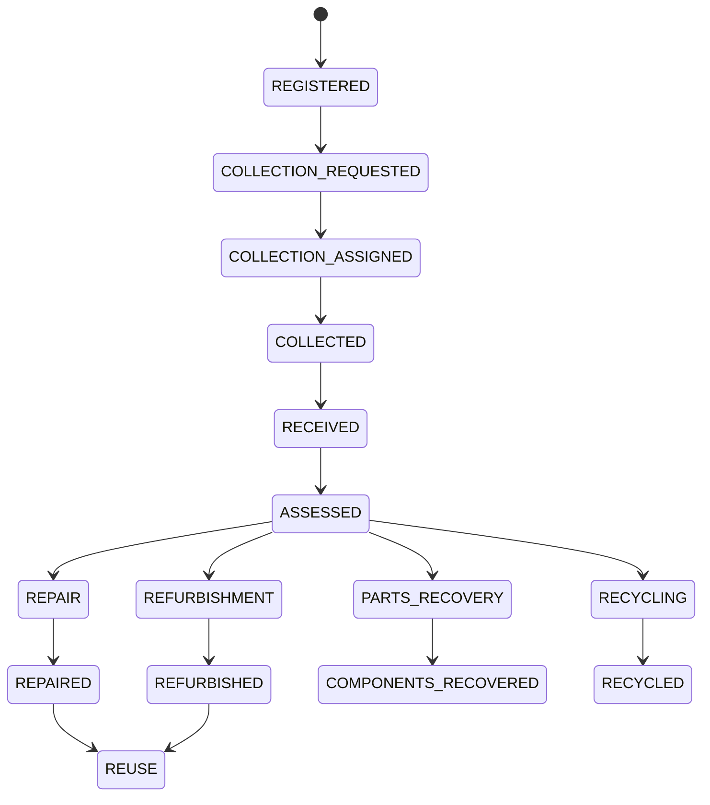

# Device lifecycle

Every registered device has a lifecycle state. We keep the current state and the history of meaningful changes. The internal Device ID does not change. IMEI may be present and stays sensitive.

That picture is the conceptual lifecycle from the definition. It is not an operating policy.

Not specified:

- Whether a device can leave `REPAIR` for another path if it is not repairable
- Whether `REUSE` is an end state
- Whether a reused device can be collected again
- How a `CANCELLED` or `FAILED` collection shows up here
- Who may move a device between branches
- Whether ownership changes at handover

A technician can record "not repairable". There is no lifecycle state with that name. How that maps onto parts recovery or recycling is [TBD]. Decide it with C-04, because it depends on what an assessment is.

| State | Meaning |
| --- | --- |
| `REGISTERED` | The device has an internal id and a record |
| `COLLECTION_REQUESTED` | A pickup has been asked for |
| `COLLECTION_ASSIGNED` | An agent has been assigned |
| `COLLECTED` | The device has been collected |
| `RECEIVED` | The next stage has the device |
| `ASSESSED` | An assessment is on record |
| `REPAIR`, `REPAIRED`, `REUSE` | Repair path, then back into use |
| `REFURBISHMENT`, `REFURBISHED`, `REUSE` | Refurbishment path, then back into use |
| `PARTS_RECOVERY`, `COMPONENTS_RECOVERED` | Components recovered |
| `RECYCLING`, `RECYCLED` | Recycled |

`COLLECTED` here is a device state. Collection requests also have a status called `COLLECTED`. Do not implement them as the same field until C-02 is resolved.

A meaningful change writes a history row. Handover and partner records belong in that history. Timestamps are required. Which moments count as "relevant" should be made exact in the schema. Do not drop earlier events when a new status is saved.

The registry is this history plus the identity, collection, assessment, pathway, partner, and audit detail in [../product/requirements.md](../product/requirements.md). People read the part their role allows. They do not all see the owner's personal details.

A verified circular action may later write a points row and feed an impact count. Neither the earning rule nor the public formula is defined. The lifecycle event is still recorded when no points are issued.
