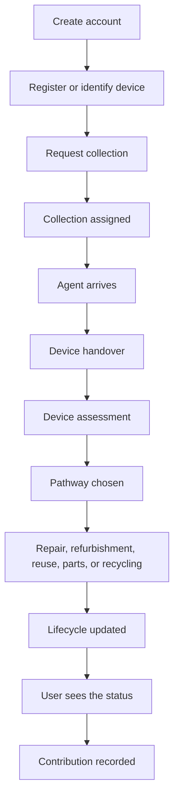

# Flows

These are the journeys in the product definition. Steps that depend on a missing rule are marked [TBD].

## Household

Not specified:

- If both the household and the agent may register a device, who does it on a normal pickup
- Who picks the pathway, and who can override it
- Which status updates the household sees
- When a contribution or a points entry is written

## Requesting a pickup

The household picks one or more devices, gives the collection details, gives or picks a time window, and submits. The platform creates the request.

An administrator, or whatever dispatch process we end up with, assigns it to an eligible agent. Eligibility and automatic dispatch are [TBD]. Nothing in the definition requires automatic dispatch.

## Agent on the pickup

The agent gets the assignment, goes to the location, confirms the person, confirms the device, records the collection, updates the status, and moves the device to the next stage.

They may also register the device, capture details, do a preliminary assessment, take the photos that are required, and record the handover. Required photos are [TBD].

If the assignment is already on the phone, the agent can write those records with no network and sync later.

## After handover

Assessment, then one path:

- Repair, then repaired, then reuse
- Refurbishment, then refurbished, then reuse
- Parts recovery, then components recovered
- Recycling, then recycled

State names are in [../operations/lifecycle.md](../operations/lifecycle.md).

The definition does not say every device reaches an end state, or what happens when a path cannot be finished. `FAILED` and `CANCELLED` are collection statuses, not lifecycle outcomes. How a failed pickup changes the device record is [TBD].

## Organization

Register, register many devices, request bulk collection, watch the pickups, open reports. The step-by-step bulk flow is not written down beyond that.

## Specialist work

| Role | What they record |
| --- | --- |
| Technician | Diagnosis, parts, repair status, repaired or not repairable |
| Refurbisher | The work, condition, ready for reuse or resale |
| Recycler | Receipt, recycling activity, material recovery when known, downstream confirmation |

Handover between them has to appear in the registry. The yard procedure for that handover is not fully written.

## Two assessments

Agents do a preliminary assessment. Technicians record a diagnosis and can mark a device not repairable. The household journey shows one assessment step after handover.

We do not know if those are one record or two. That is C-04 in [requirements.md](requirements.md). Do not build either model until that is decided.

## Messages along the way

Send a notice for: request received, collection assigned, agent on the way, collection completed, device received, assessment done, repair done, refurbishment done, device transferred, recycling done, points earned.

Channel per event is [TBD]. The candidates are in-app, SMS, WhatsApp, and email.

## Other ways in

The definition says we cannot assume a smartphone or reliable data. Channels to consider: the phone app, mobile web, USSD, SMS, WhatsApp, and someone else registering the device for the household. USSD is the menu a person gets by dialing a short code.

Only the Android app is being built. The other channels stay [TBD] until cost, access, and the pilot operation are checked. Assisted registration has no written procedure.
